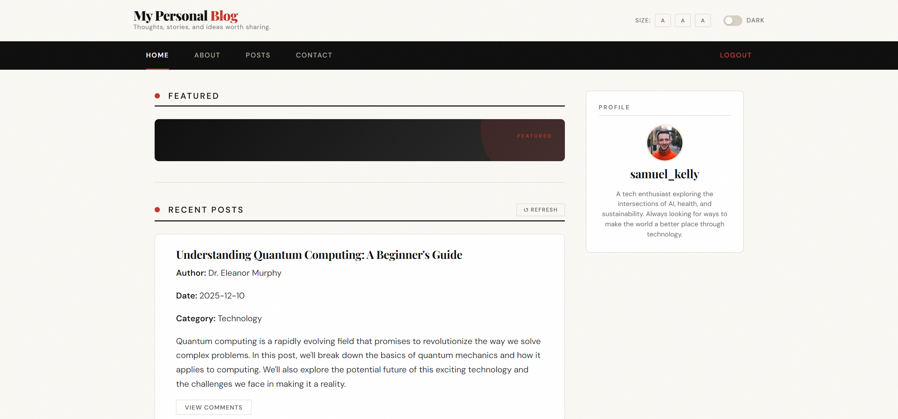
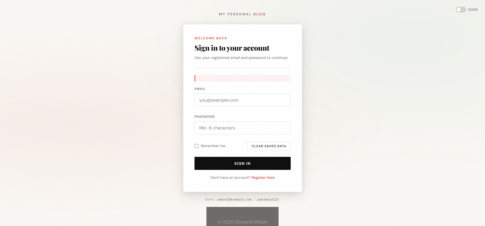

# 📝 My Personal Blog – Frontend Blogging Platform


**My Personal Blog** is a modular, frontend-only blogging platform built with vanilla HTML, CSS, and JavaScript. It features user authentication, blog post rendering, a comments system, dark mode, font controls, and a user profile — all without any backend or database, running entirely in the browser via `localStorage`.

---

## 📸 Screenshots






---

## 🧩 Features

- Browse and read blog posts loaded from `localStorage`
- Leave and view comments per post
- User registration and login system
- Session persistence across page reloads
- Dark mode with toggle, persisted in `localStorage`
- Font size controls (small / medium / large)
- User profile display with avatar and bio
- Responsive layout — works on mobile and desktop
- Editorial magazine aesthetic with smooth CSS animations
- Fully static — deployable to Vercel, Netlify, or GitHub Pages

---

## 🚀 Getting Started

### 🔧 Requirements

- Node.js 16+
- npm

### ▶️ Run Locally

```bash
# Install dependencies
npm install

# Start development server
npm start
```

Parcel will serve all pages with hot reload at `http://localhost:1234`.

### 📦 Production Build

```bash
npm run build
```

Output is generated into the `/dist` folder, ready for deployment.

---

## 🔑 Demo Credentials

The app ships with a built-in demo account:

| Field    | Value                  |
|----------|------------------------|
| Email    | `samuel@example.com`   |
| Password | `password123`          |

You can also register your own account — it will be saved to your browser's `localStorage`.

---

## 📁 Project Structure

```
personal-blog-website/
│
├── vercel.json                  # Vercel routing config
├── package.json                 # Scripts and dependencies
│
└── src/
    ├── css/
    │   ├── base.css             # Design tokens, typography, animations
    │   ├── layout.css           # Header, nav, grid, footer
    │   ├── components.css       # Buttons, cards, inputs, posts, comments
    │   ├── dark-mode.css        # Full dark theme overrides
    │   ├── styles.css           # Aggregator — imports all CSS files
    │   │
    │   └── pages/
    │       ├── main.css         # Homepage, About, Contact page styles
    │       ├── login.css        # Auth page styles
    │       └── registration.css # Registration-specific overrides
    │
    ├── html/
    │   ├── main.html            # Homepage
    │   ├── posts.html           # Blog posts listing
    │   ├── about.html           # About page
    │   ├── contact.html         # Contact form
    │   ├── login.html           # Login page
    │   └── registration.html    # Registration page
    │
    ├── images/
    │   └── (static assets)
    │
    └── js/
        ├── store.js             # localStorage database (replaces db.json)
        ├── blog.js              # Post rendering
        ├── comments.js          # Comment fetch and submit
        ├── login.js             # Authentication logic
        ├── registration.js      # Account creation
        ├── main.js              # Dark mode + page transitions
        ├── ui.js                # Shared UI helpers (loading spinner)
        ├── logout.js            # Session clearing
        ├── profile.js           # User profile display
        ├── font-controls.js     # Font size toggle
        ├── about.js             # About page interactions
        └── contact.js           # Contact form handling
```

---

## 🎨 Design System

The UI follows an **editorial magazine aesthetic** — warm cream tones, near-black ink, and an editorial red accent.

| Token | Value | Usage |
|---|---|---|
| `--ink` | `#0e0e0e` | Headings, strong text |
| `--cream` | `#faf8f4` | Page background |
| `--accent` | `#c0392b` | Primary red accent |
| `--accent-alt` | `#1a6b4a` | Secondary green accent |
| `--font-display` | Playfair Display | All headings |
| `--font-body` | DM Sans | Body text, labels, buttons |

---

## 🗄️ Data Layer

The original `db.json` + `json-server` setup has been replaced with a `localStorage`-based store (`store.js`) that works fully offline and on static hosts.

`store.js` provides:

- `Store.getPosts()` — all blog posts
- `Store.getCommentsByPostId(id)` — comments filtered by post
- `Store.addComment(postId, author, content)` — save a new comment
- `Store.registerAccount(...)` — create a user account
- `Store.loginAccount(email, password)` — authenticate a user
- `Store.setSession(user)` / `Store.clearSession()` — manage login state
- `Store.seed()` — seeds initial data on first load

> `store.js` must be the **first** `<script>` tag on every HTML page.

---

## 🛡️ Security Notes

- Passwords are stored in plain text in `localStorage` — this is a demo project only
- Authentication is entirely client-side with no server validation
- Do not use this system to store real or sensitive credentials
- Session state is cleared on logout via `Store.clearSession()`

---

## 📄 License

MIT License

---

## 👤 Author

Built by **Osmund Million** – 2025
Happy coding!